# Cadence education fund
First a few ground rules.
> :warning: **Expected error**: This will denote an error that is expected to occur (a good error).

> ℹ️ **Info**: General helpful information

## Deploy FLOW contracts

Deploy the FungibleToken interface on 0x01

Deploy the FlowToken contract on 0x02

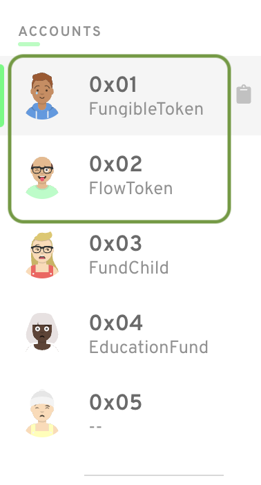

## Deploy fund contracts

Deploy the FundChild interface on 0x03

Deploy the EducationFund contract on 0x04

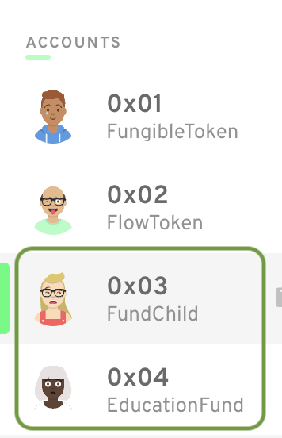

## Get FLOW ready for use
> ℹ️ **Info**: In the interest of demo time this transaction will set up FLOW for all accounts at once.  This call will set up basic flow vaults/storage/references

Call "Set up FLOW" transaction signed by all accounts.

You should see the following output:

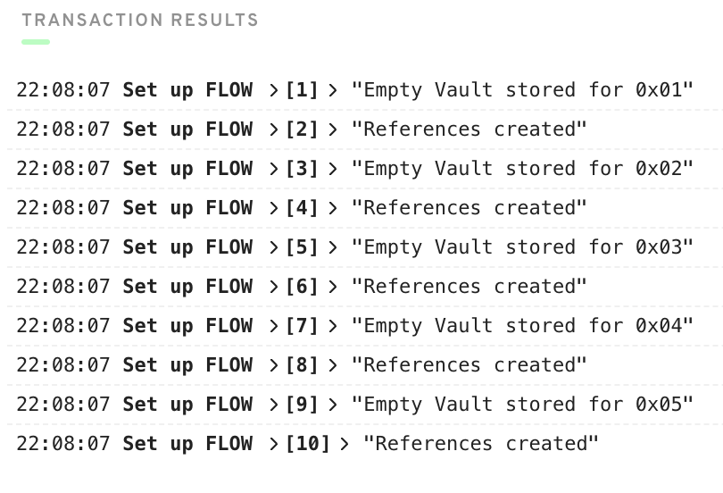

## Check FLOW balances

Execute the "Check FLOW balances" script

You should see the following output:

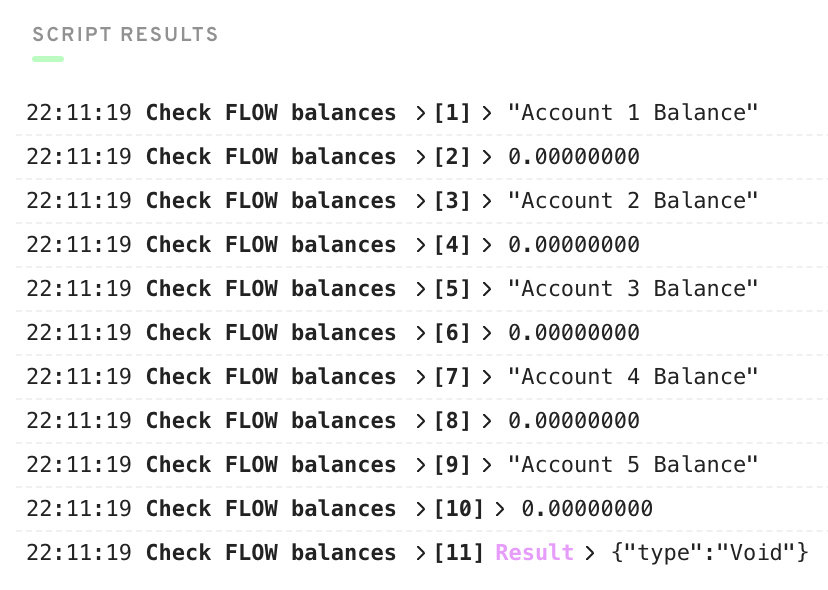

## Mint FLOW for all accounts
> ℹ️ **Info**: We use this account because it is the owner of the FlowToken contract

Call "Mint FLOW for all accounts" transaction signed by account 0x02

You should see the following output:

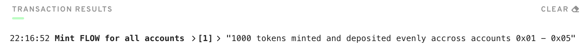

## Check the account balances again

Execute the "Check FLOW balances" script

You should see the following output:

> ℹ️ **Info**: As you can see, 1000 FLOW was minted and 200 FLOW was given to each account

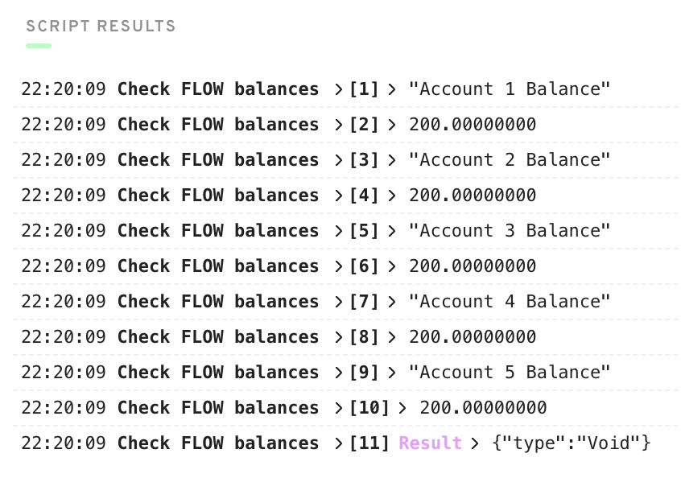

## Start the fund
> ℹ️ **Info**: We will use accounts 0x01 (Manager) and 0x05 (Beneficiary) but this could be done with any two accounts

Call "Start fund" transaction signed by 0x01 (Manager) and 0x05 (Beneficiary) in that order

You should see the following output:

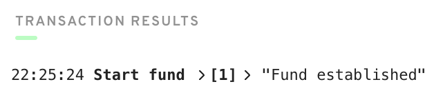

## Check the fund's balance

Execute "Check fund balance" script

You should see the following output:

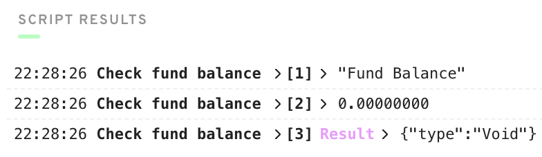

## Make your first donation to the fund

Let's make a 50 FLOW donation with account 0x03 (just because 0x03 is unaffiliated with the fund)

Call "Public donation (50)" transaction signed by account 0x03

You should see the following output:

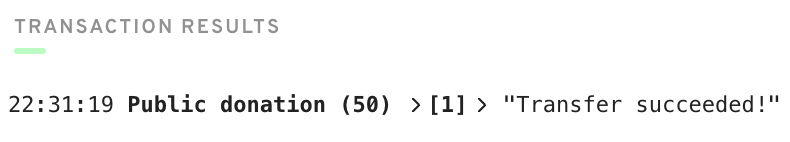

## Check the account balances again

Execute the "Check FLOW balances" script

You should see the following output:

> ℹ️ **Info**: 50 FLOW moved from account 0x03 to the fund!

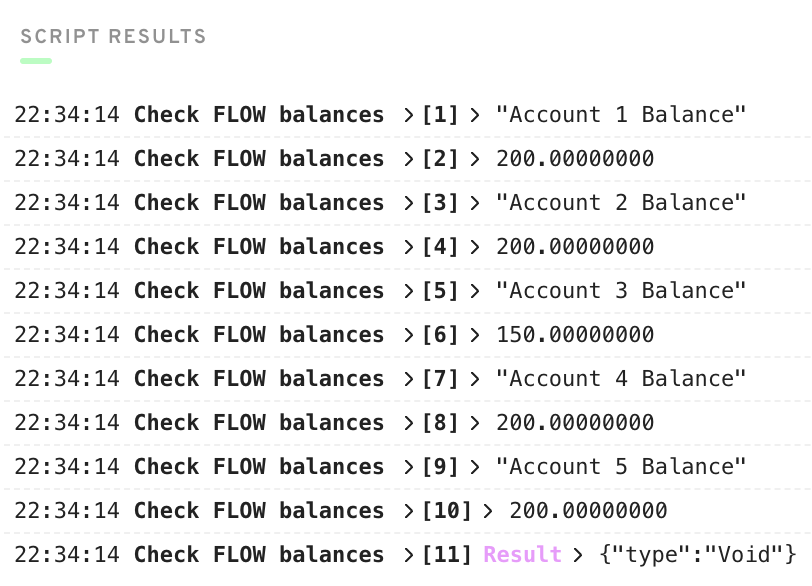

## Check the fund's balance again

Execute "Check fund balance" script

You should see the following output:

> ℹ️ **Info**: We have FLOW in our fund!

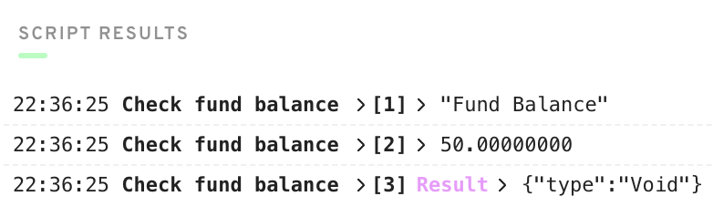

## As fund benificiary, try to withdraw 50 FLOW (a pre condition failure is expected)
> ℹ️ **Info**: Accounts 0x01 and 0x05 will be refered to as 0x01 (Manager) and 0x05 (Beneficiary), respectively

Call "Fund withdraw (50)" transaction signed by 0x05 (Beneficiary)

Should FAIL with the following output:

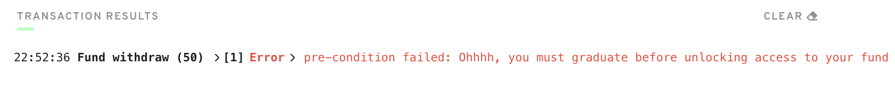

> ℹ️ **Info**: This failure was expected as the Manager's condition of first graduating post-secondary school hadn't been met

## As fund manager, mark the beneficiary as graduated

Call "Set graduated" transaction signed by account 0x01 (Manager)

You should see the following output:

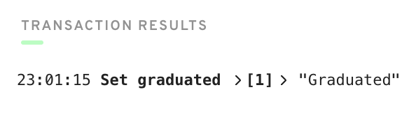

## As fund benificiary, try to withdraw 50 FLOW (this too will fail because the limit defaults to zero!)

Call "Fund withdraw (50)" transaction signed by 0x05 (Beneficiary)

Should FAIL with the following output:

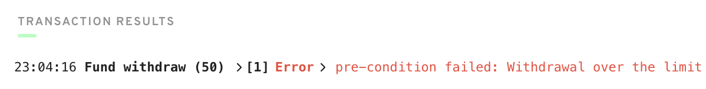

> ℹ️ **Info**: This failure was expected as the Manager's condition of first graduating post-secondary school hadn't been met

## As fund manager, set the beneficiary's limit to 100 FLOW

Call "Set limit (100)" transaction signed by account 0x01 (Manager)

You should see the following output:

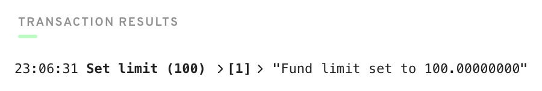

## As fund benificiary, withdraw 50 FLOW (we can finally do it!)

Call "Fund withdraw (50)" transaction signed by 0x05 (Beneficiary)

You should see the following output:

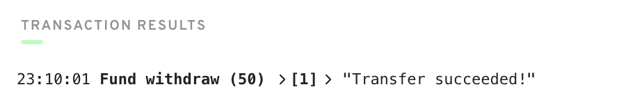

> ℹ️ **Info**: Feel free to check the account or fund balances by executing "Check FLOW balances" and "Check fund balance" scripts respectively

## Somebody is donating 100 FLOW!

Let's make two 50 FLOW donations with account 0x04

> ℹ️ **Info**: Call this transaction twice, that's what the (x2) is signifying

Call "Public donation (50)" transaction signed by account 0x04 (x2)

You should see the following output:

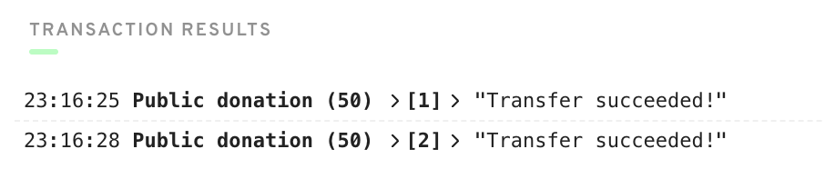

## As fund benificiary, withdraw 50 FLOW

Call "Fund withdraw (50)" transaction signed by 0x05 (Beneficiary)

You should see the following output:

> ℹ️ **Info**: Feel free to check the account or fund balances by executing "Check FLOW balances" and "Check fund balance" scripts respectively

## As fund benificiary, withdraw 50 more FLOW (this will fail because we have reached our limit)

Call "Fund withdraw (50)" transaction signed by 0x05 (Beneficiary)

Should FAIL with the following output:

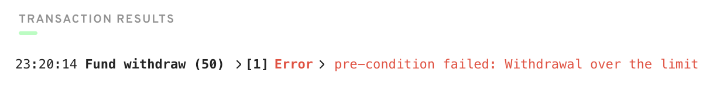

## As fund manager, set the beneficiary's limit back to 100 FLOW

Call "Set limit (100)" transaction signed by account 0x01 (Manager)

You should see the following output:

## Now the withdrawal will succeed!

Call "Fund withdraw (50)" transaction signed by 0x05 (Beneficiary)

You should see the following output:

## Confirm the balances

Execute the "Check FLOW balances" script

You should see the following output:

> ℹ️ **Info**: We should see 50 FLOW missing from account 0x03 and 100 FLOW from account 0x04.  The 150 FLOW hs gone to the fund and the withdrawn by 0x05 (Beneficiary)

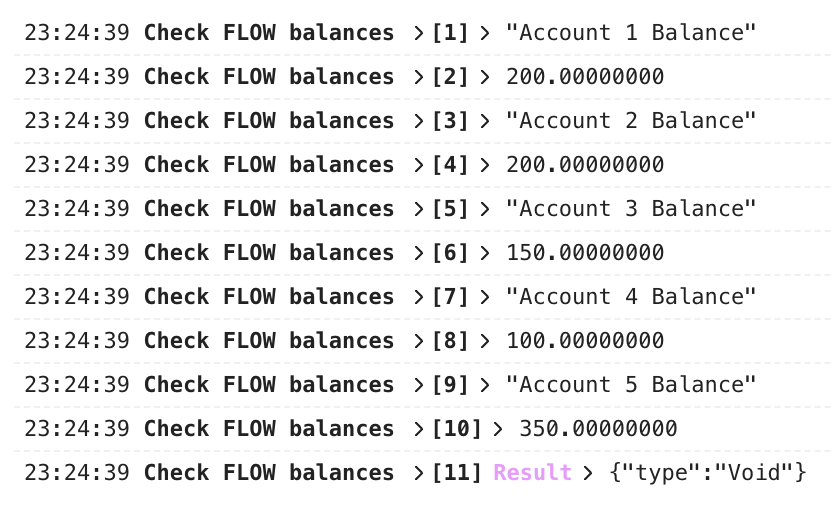

## Manager should not be able to reduce limit

### Set limit to 100

Call "Set limit (100)" transaction signed by account 0x01 (Manager)

You should see the following output:

### Try to do a lower limit

On "Set limit (100)", Change line 7 to 99.0

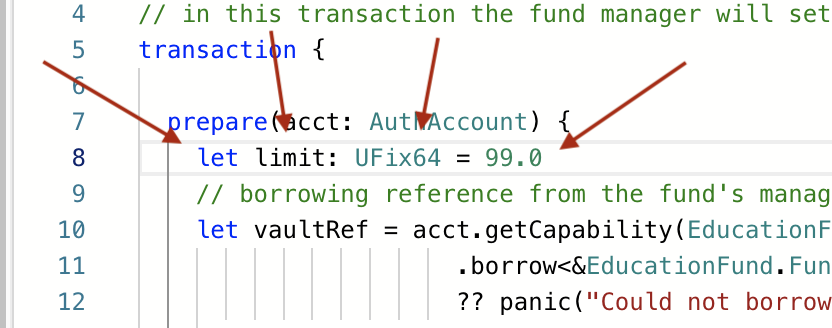

Call "Set limit (100)" transaction signed by account 0x01 (Manager)

Should FAIL with the following output:

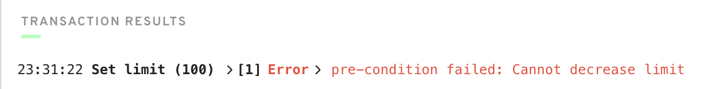

> ℹ️ **Info**: Please set line 7 back to 100

# Thank you very much!